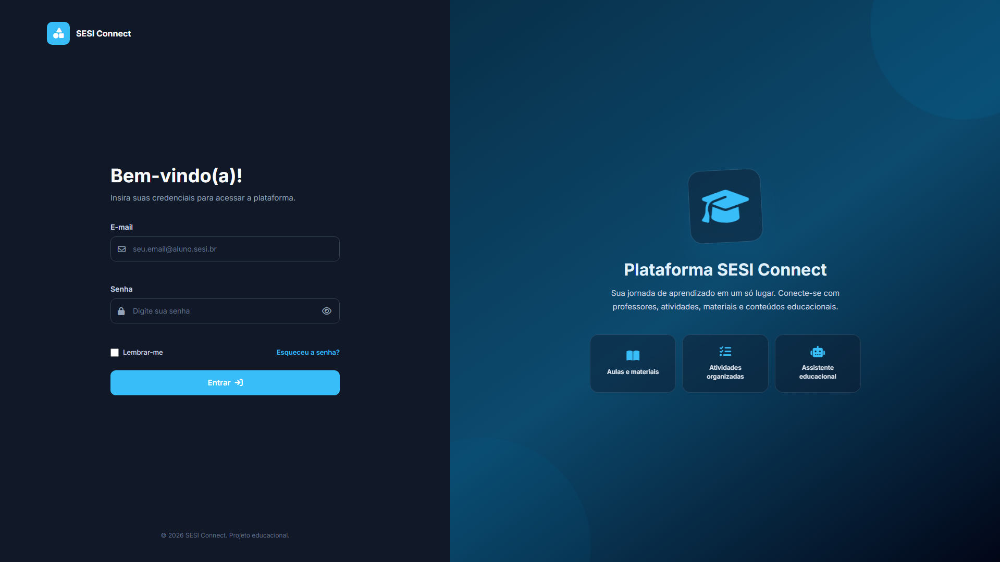
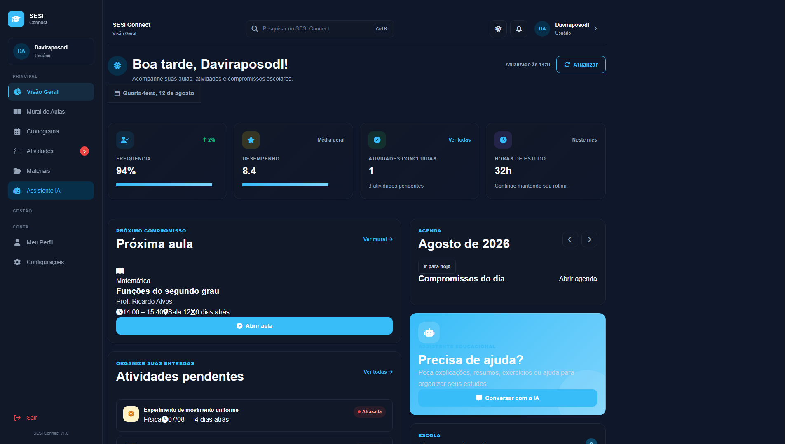
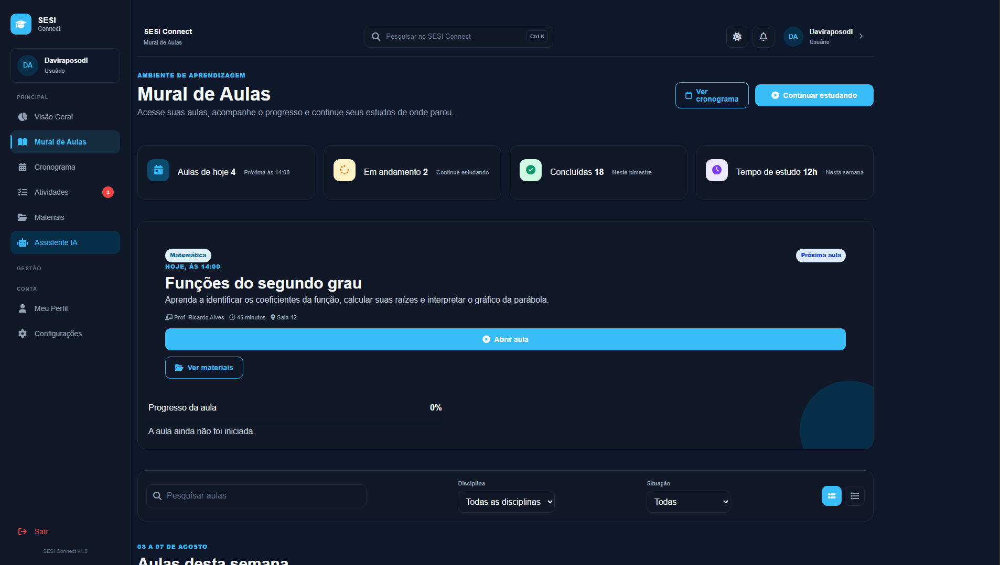
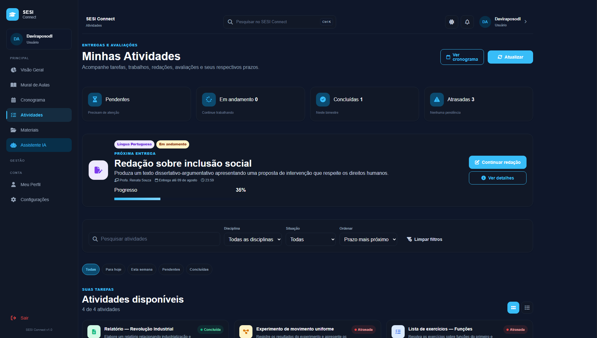

# SESI Connect

> Plataforma educacional para centralização de materiais pedagógicos, atividades, aulas e recursos de Inteligência Artificial para alunos e professores da rede SESI.

---

## 📚 Sobre o Projeto

### Problema

Durante a rotina escolar, identificamos que muitos alunos enfrentam dificuldades para acessar os materiais pedagógicos disponibilizados pelos professores após as aulas. Essa dificuldade pode prejudicar a revisão dos conteúdos e a preparação para avaliações e provas.

Também observamos que nem todos os alunos conseguem participar dos aulões preparatórios para o ENEM realizados aos finais de semana. Compromissos como cursos, atividades extracurriculares ou até mesmo a necessidade de descanso podem impedir a participação nesses encontros, fazendo com que alguns estudantes percam conteúdos importantes.

### Solução

O **SESI Connect** foi desenvolvido como uma plataforma educacional que centraliza materiais pedagógicos e recursos de aprendizagem em um único ambiente digital.

A plataforma permite que alunos e professores tenham acesso organizado a aulas, atividades, cronogramas, apostilas, questões, listas de exercícios e gravações de aulões.

Além disso, o sistema contará com recursos de **Inteligência Artificial**, que poderão auxiliar os professores na criação de questões, listas de exercícios e sugestões de atividades com base nos conteúdos trabalhados em aula.

Dessa forma, o SESI Connect busca tornar o acesso ao conteúdo mais **organizado, acessível e eficiente**, permitindo que os alunos estudem no momento mais conveniente para eles.

---

## 🎯 Objetivo

Desenvolver uma plataforma educacional capaz de centralizar materiais pedagógicos, atividades e gravações de aulas em um único ambiente, facilitando o acesso ao conteúdo por alunos e professores e contribuindo para uma aprendizagem mais organizada e eficiente.

---

## 👥 Público-Alvo

* Alunos da rede SESI;
* Professores da rede SESI.

---

## ⚙️ Funcionalidades

* 🔐 Login e autenticação de usuários;
* 👨‍🎓 Cadastro de alunos;
* 👨‍🏫 Cadastro de professores;
* 📚 Mural de aulas;
* 📝 Mural de atividades;
* 📅 Cronograma de aulas;
* 📂 Repositório de materiais pedagógicos;
* 🎥 Acesso a gravações de aulas e aulões;
* 📖 Apostilas e materiais de apoio;
* ❓ Questões e listas de exercícios;
* 🤖 Inteligência Artificial para auxílio aos professores;
* 👤 Gerenciamento de perfil;
* ⚙️ Configurações da plataforma.

---

## 💻 Tecnologias Utilizadas

### Front-end

* HTML5 — estrutura das páginas;
* CSS3 — estilização e identidade visual;
* JavaScript — interatividade e funcionalidades da interface.

### Back-end

* PHP — desenvolvimento da lógica do sistema e comunicação com o banco de dados.

### Banco de Dados

* MySQL — armazenamento e gerenciamento dos dados da plataforma.

### Inteligência Artificial

* API de Inteligência Artificial generativa — utilização de modelos de IA para auxiliar na criação de questões, listas de exercícios e atividades educacionais.

### Ferramentas

* Git — controle de versão;
* GitHub — hospedagem do código e gerenciamento do projeto;
* Visual Studio Code — ambiente de desenvolvimento.

---

## 🎨 Identidade Visual

A identidade visual do **SESI Connect** foi concebida e desenvolvida por [**Jael Feijó**]([https://instagram.com/usuario](https://www.instagram.com/jaelfeijo_/)), responsável pela criação da logo, conceito visual e elementos gráficos que representam a identidade da plataforma.

A identidade visual do SESI Connect utiliza uma combinação de cores voltada para educação e tecnologia:

* 🔵 **Azul:** confiança, tecnologia e educação;
* 🟢 **Verde:** crescimento, desenvolvimento e aprendizagem;
* ⚪ **Branco:** simplicidade, organização e facilidade de leitura.

A interface foi planejada para possuir um design **moderno, intuitivo e responsivo**, proporcionando uma boa experiência em computadores e dispositivos móveis.

---

## 🖼️ Imagens do Projeto

### Tela de Login

### Dashboard

### Mural de Aulas

### Mural de Atividades

### Inteligência Artificial

> As imagens serão atualizadas conforme o desenvolvimento do projeto.

---

## 🔗 Link do Projeto

**Repositório:**
[GitHub SESI Connect](https://github.com/davirlima7-debug/sesi-connect)

**Demonstração:**
[Acessar Sesi Connect](#)

> Os links serão adicionados após a publicação do projeto.

---

## 👥 Integrantes

O SESI Connect é desenvolvido por:

| Integrante         |
| ------------------ |
| **Davi Raposo**    |
| **Eduardo Lucas**  |
| **Emmanuel Vitor** |
| **Gabriel Lima**   |
| **Kauã Riquelme**  |
| **Manoel Ricardo** |
| **Nicolas Maciel** |
| **Rafael Rocha**   |

---

## 📌 Status do Projeto

🚧 **Em desenvolvimento**

O SESI Connect está sendo desenvolvido como um projeto acadêmico, com funcionalidades sendo implementadas gradualmente.

---

## 📄 Licença

Este projeto foi desenvolvido para fins acadêmicos.
