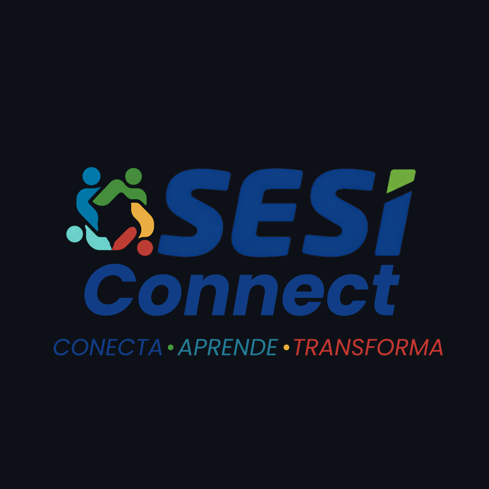

# 

**Plataforma educacional para alunos e professores da rede SESI**

 

---

## Sobre o Projeto

O **SESI Connect** é uma plataforma educacional desenvolvida para centralizar materiais pedagógicos, atividades, aulas e recursos de Inteligência Artificial em um único ambiente digital.

A proposta é facilitar o acesso dos alunos aos conteúdos disponibilizados pelos professores, permitindo que materiais, atividades, cronogramas, apostilas, questões e gravações de aulas estejam organizados em uma única plataforma.

O sistema também contará com recursos de **Inteligência Artificial** destinados ao suporte dos professores na criação de questões, listas de exercícios e sugestões de atividades educacionais.

---

## Problema

Durante a rotina escolar, alunos podem enfrentar dificuldades para acessar e organizar os materiais pedagógicos disponibilizados pelos professores após as aulas.

A ausência de um ambiente centralizado pode dificultar:

* A revisão dos conteúdos;
* O acompanhamento das atividades;
* A organização dos materiais;
* A preparação para avaliações;
* O acesso a conteúdos apresentados em aulas e aulões.

Além disso, alguns alunos não conseguem participar de aulões preparatórios para o ENEM realizados aos finais de semana devido a cursos, atividades extracurriculares, compromissos pessoais ou outros fatores.

Como consequência, esses estudantes podem perder conteúdos importantes para sua preparação.

---

## Solução

O **SESI Connect** centraliza os principais recursos utilizados durante o processo de aprendizagem em um único ambiente digital.

A plataforma permite o acesso organizado a:

* Aulas;
* Atividades;
* Cronogramas;
* Materiais pedagógicos;
* Apostilas;
* Questões;
* Listas de exercícios;
* Gravações de aulas;
* Aulões preparatórios.

Além disso, recursos de **Inteligência Artificial** poderão auxiliar professores na elaboração de conteúdos e atividades educacionais.

---

## Objetivo

Desenvolver uma plataforma educacional capaz de centralizar materiais pedagógicos, atividades, aulas e recursos complementares em um único ambiente digital.

O objetivo é facilitar o acesso ao conteúdo por alunos e professores, contribuindo para uma experiência de aprendizagem mais organizada, acessível e eficiente.

---

## Público-Alvo

O SESI Connect é destinado principalmente a:

* **Alunos da rede SESI**
* **Professores da rede SESI**

---

## Funcionalidades

### Autenticação e Usuários

* Sistema de login e autenticação;
* Cadastro de alunos;
* Cadastro de professores;
* Gerenciamento de perfil;
* Configurações da plataforma.

### Recursos Educacionais

* Mural de aulas;
* Mural de atividades;
* Cronograma de aulas;
* Repositório de materiais pedagógicos;
* Apostilas e materiais de apoio;
* Questões e listas de exercícios;
* Gravações de aulas e aulões.

### Inteligência Artificial

* Auxílio na criação de questões;
* Geração de listas de exercícios;
* Sugestões de atividades;
* Suporte aos professores na elaboração de conteúdos.

---

## Tecnologias

### Front-end

**HTML5**
Estrutura e organização das páginas.

**CSS3**
Estilização, responsividade e identidade visual.

**JavaScript**
Interatividade e funcionalidades da interface.

### Back-end

**PHP**
Desenvolvimento da lógica de negócio e comunicação com o banco de dados.

### Banco de Dados

**MySQL**
Armazenamento, organização e gerenciamento dos dados da plataforma.

### Inteligência Artificial

**API de Inteligência Artificial generativa**
Utilização de modelos de IA para auxiliar na criação de questões, listas de exercícios e atividades educacionais.

### Ferramentas

**Git** — controle de versão.

**GitHub** — hospedagem do código-fonte e gerenciamento do projeto.

**Visual Studio Code** — ambiente de desenvolvimento.

---

## Identidade Visual

A identidade visual do **SESI Connect** foi concebida e desenvolvida por **[Jael Feijó](https://www.instagram.com/jaelfeijo_/)**, responsável pela criação da logo, conceito visual e elementos gráficos utilizados na plataforma.

A identidade visual foi desenvolvida com foco nos conceitos de **educação, tecnologia, confiança e desenvolvimento**.

| Cor    | Conceito                                    |
| ------ | ------------------------------------------- |
| Azul   | Confiança, tecnologia e educação            |
| Verde  | Crescimento, desenvolvimento e aprendizagem |
| Branco | Simplicidade, organização e clareza         |

A interface foi projetada para apresentar um design moderno, intuitivo e responsivo, proporcionando uma experiência adequada em diferentes dispositivos.

---

# Interface

## Tela de Login

---

## Dashboard

---

## Mural de Aulas

---

## Mural de Atividades

---

## Inteligência Artificial

> As imagens serão atualizadas conforme o desenvolvimento e evolução da plataforma.

---

## Equipe

O **SESI Connect** é desenvolvido por:

| Integrante     |
| -------------- |
| Davi Raposo    |
| Eduardo Lucas  |
| Emmanuel Vitor |
| Gabriel Lima   |
| Kauã Riquelme  |
| Manoel Ricardo |
| Nicolas Maciel |
| Rafael Rocha   |

### Identidade Visual

**Jael Feijó** — responsável pela criação da identidade visual, logo e elementos gráficos do projeto.

[Instagram — Jael Feijó](https://www.instagram.com/jaelfeijo_/)

---

## Repositório

---

## Status do Projeto

**Em desenvolvimento**

O SESI Connect está sendo desenvolvido como um projeto acadêmico. As funcionalidades estão sendo implementadas e aprimoradas progressivamente ao longo do desenvolvimento.

---

## Licença

Este projeto foi desenvolvido para fins acadêmicos.

---

 

**SESI Connect**

*Tecnologia, educação e aprendizagem em um único ambiente.*

